 Gmail Filter (local, Docker)

Self-hosted web app to search Gmail with the **same query operators as the Gmail web UI**, **sync message metadata** into a local SQLite cache, view **aggregates** (bubble chart or list) by sender/domain/age/newsletter heuristics, **preview** messages, and **archive / trash / mark read** in bulk—with **progress** and **force cancel** on long jobs.

**Official Gmail search operators:** [Google Help: Search operators](https://support.google.com/mail/answer/7190)

---

## Prerequisites

- [Docker Desktop](https://www.docker.com/products/docker-desktop/) (Windows, macOS, or Linux)
- A Google account with Gmail
- A browser

---

## 1. Docker setup

### 1.0 Pre-built image (no git clone)

If you only want to run the app and do **not** need the source tree, use the image published to **GitHub Container Registry** (`ghcr.io`). You still create your **own** Google OAuth client and `.env` (see **Section 2**); nothing secret is baked into the image.

1. **Install [Docker](https://docs.docker.com/get-docker/)** (Docker Compose is included as `docker compose`).

2. **Create a folder** and add a `.env` file with at least:

   ```env
   GOOGLE_CLIENT_ID=your-client-id.apps.googleusercontent.com
   GOOGLE_CLIENT_SECRET=your-client-secret
   REDIRECT_URI=http://localhost:8000/api/auth/callback
   ```

   Follow **Section 2 — Google Cloud & Gmail API** to obtain the client ID and secret and to set the redirect URI in Google Cloud to match `REDIRECT_URI` exactly.

3. **Add the Compose file** for the pulled image. From the same folder as `.env`, either:

   - Download it from GitHub (use your fork’s `OWNER`/`REPO` if needed; for this upstream use `liktochung/gmail-filter` when that matches the repo you track):

     ```bash
     curl -fsSL -O https://raw.githubusercontent.com/liktochung/gmail-filter/main/docker-compose.image.yml
     ```

   - Or create `docker-compose.image.yml` yourself with the same contents as [`docker-compose.image.yml`](docker-compose.image.yml) in this repo.

   By default the service uses **`ghcr.io/liktochung/gmail-filter:latest`**. To use another image or tag (for example your fork), set the environment variable **`GMAIL_FILTER_IMAGE`** when you run Compose, or edit the `image:` line in the file.

4. **Start the stack:**

   ```bash
   docker compose -f docker-compose.image.yml pull
   docker compose -f docker-compose.image.yml up -d
   ```

5. Open **http://localhost:8000**.

**Pulling the image:** If the package on GitHub is **public**, `docker compose pull` works without logging in. If the package is **private**, sign in to the registry first, for example with a [Personal Access Token](https://docs.github.com/en/packages/working-with-a-github-packages-registry/working-with-the-container-registry#authenticating-to-the-container-registry) that has at least the `read:packages` scope:

```bash
echo YOUR_TOKEN | docker login ghcr.io -u YOUR_GITHUB_USERNAME --password-stdin
```

The exact image name and tags appear under the repository’s **Packages** section on GitHub (for example `ghcr.io/<owner>/gmail-filter:main` or `:latest`).

---

### 1.1 Environment file

In the project folder, create `.env` from the example:

```bash
# Windows
copy .env.example .env

# macOS / Linux
cp .env.example .env
```

You will fill in `GOOGLE_CLIENT_ID` and `GOOGLE_CLIENT_SECRET` after you complete **Section 2 — Google Cloud & Gmail API** below. For now you can leave placeholders; the stack will still build.

### 1.2 Run the stack

```bash
docker compose up --build
```

Open **http://localhost:8000** in your browser.

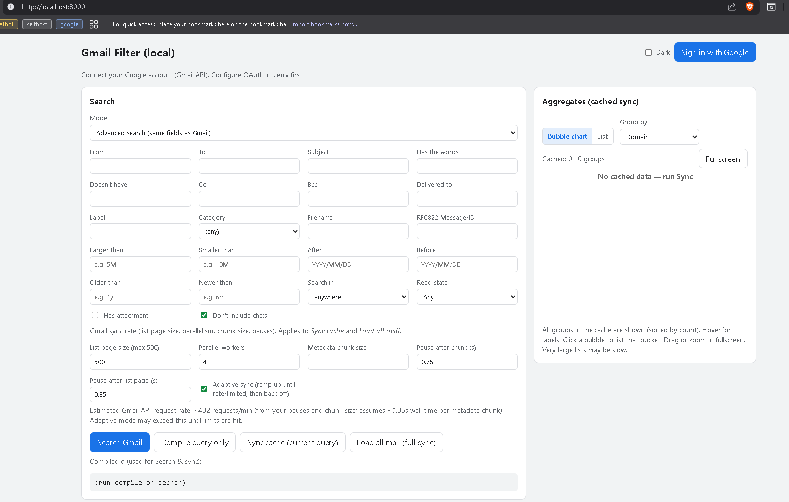

### 1.3 Where data lives

Docker Compose mounts a named volume so OAuth tokens and the SQLite cache survive container restarts:

| Path in container | Contents |
|-------------------|----------|
| `/data/tokens.json` | OAuth tokens (keep private) |
| `/data/gmail_cache.sqlite3` | Cached message metadata for aggregates |

On the host, Docker stores this volume (e.g. `gmail_data`); see **Section 6 — Removing the app** to delete it.

---

## 2. Google Cloud & Gmail API

You need a **Google Cloud project** with the **Gmail API** enabled and an **OAuth 2.0 “Web application”** client. The steps below are one-time.

### 2.1 Create or select a project

1. Open [Google Cloud Console](https://console.cloud.google.com/).
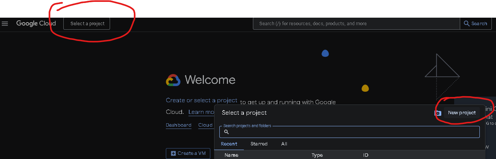
2. Use the project picker (top bar) → **New project**, or select an existing project you want to use for this app.
3. Wait until the project is active (the console shows its name in the top bar).

### 2.2 Enable the Gmail API

1. In the left menu: **APIs & Services** → **Library** (or search “APIs & Services”).
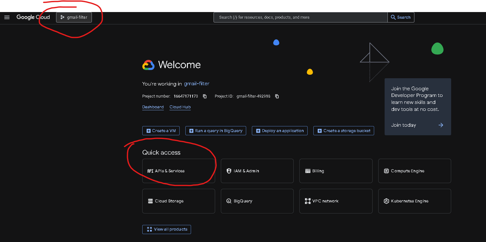
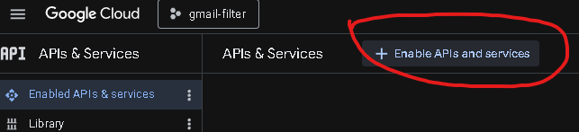

2. Search for **Gmail API**.
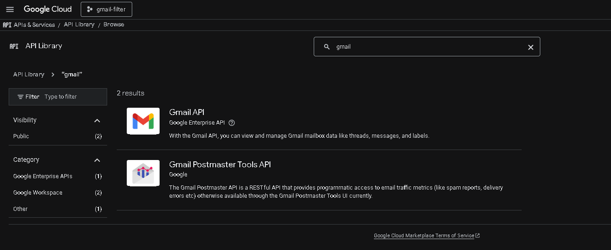

3. Open **Gmail API** → click **Enable**.
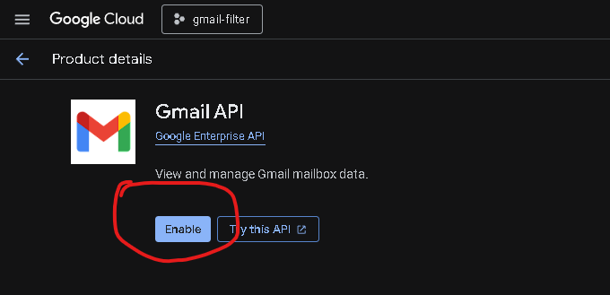

4. Wait until the API shows as enabled (you may return to the **Enabled APIs** list to confirm).


### 2.3 OAuth consent screen

The consent screen is what Google shows when you click **Sign in with Google** in this app.

1. Go to **APIs & Services** → **OAuth consent screen**.
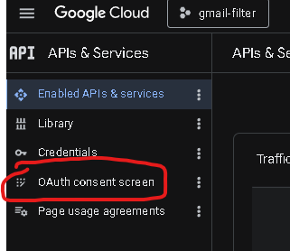

2. **User type**
   - Choose **External** if you use a normal Gmail / Google account (typical for personal use).
   - **Internal** only applies to Google Workspace accounts where your admin restricts which apps are allowed.
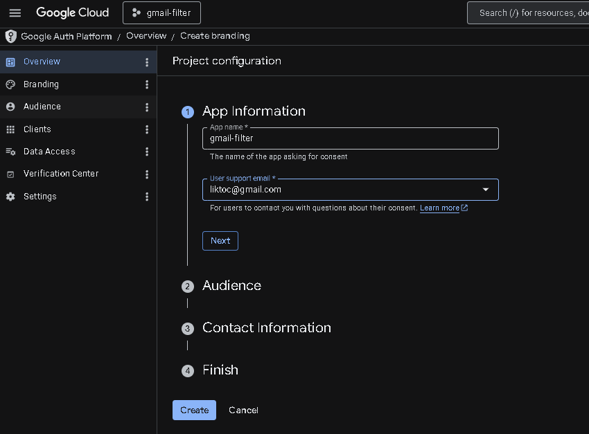
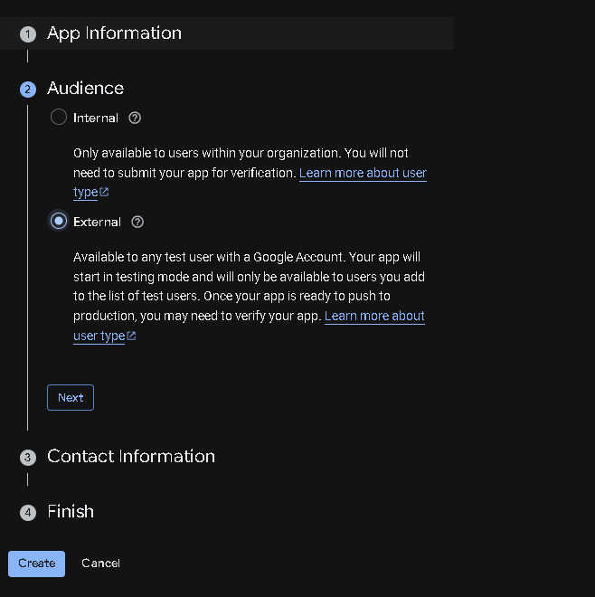

3. Click **Create** and fill the required fields (e.g. **App name**, **User support email**, **Developer contact email**).
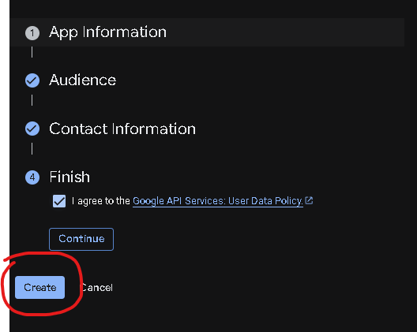

4. **Scopes** — **Add or remove scopes**
   - Find **Gmail API** and add  
     `https://www.googleapis.com/auth/gmail.modify`  
     (may appear summarized as read/compose/send; this scope is what the app needs for listing mail, trash, archive, and read/unread—not only “sending”.)
   - Save the scopes and continue.
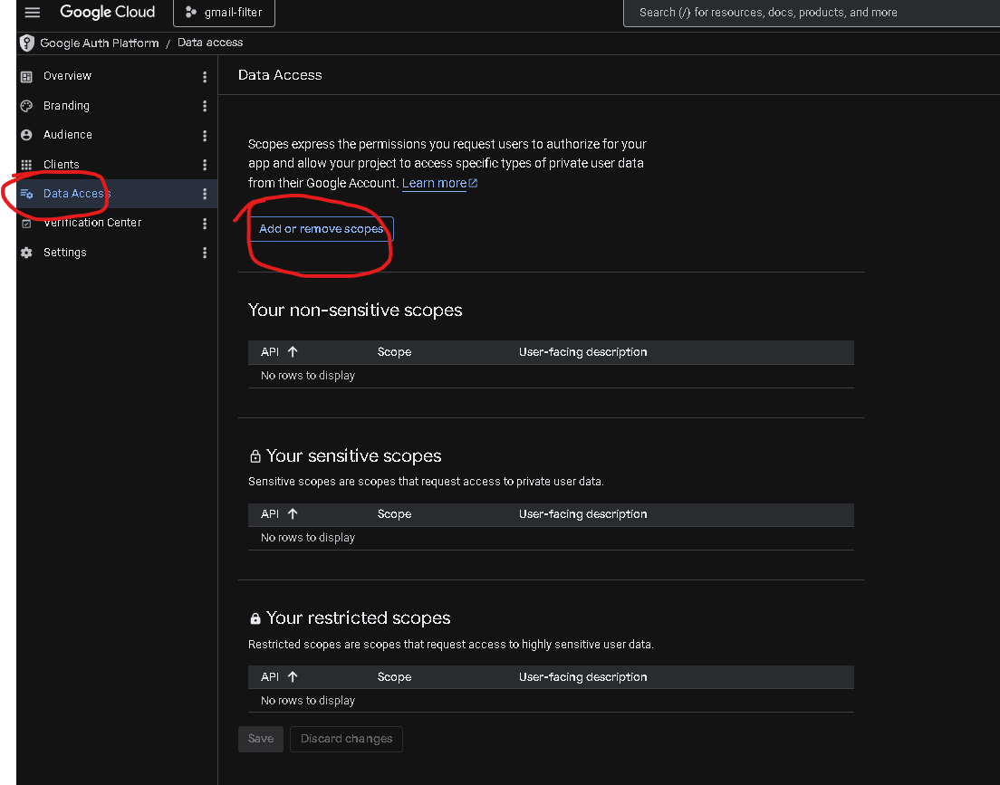
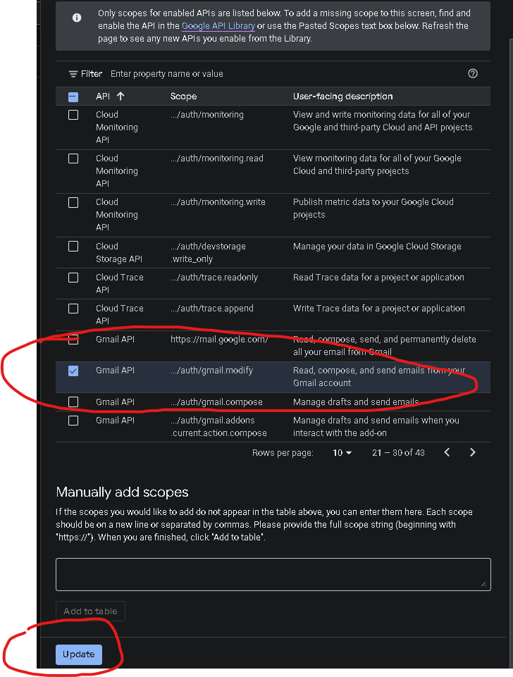
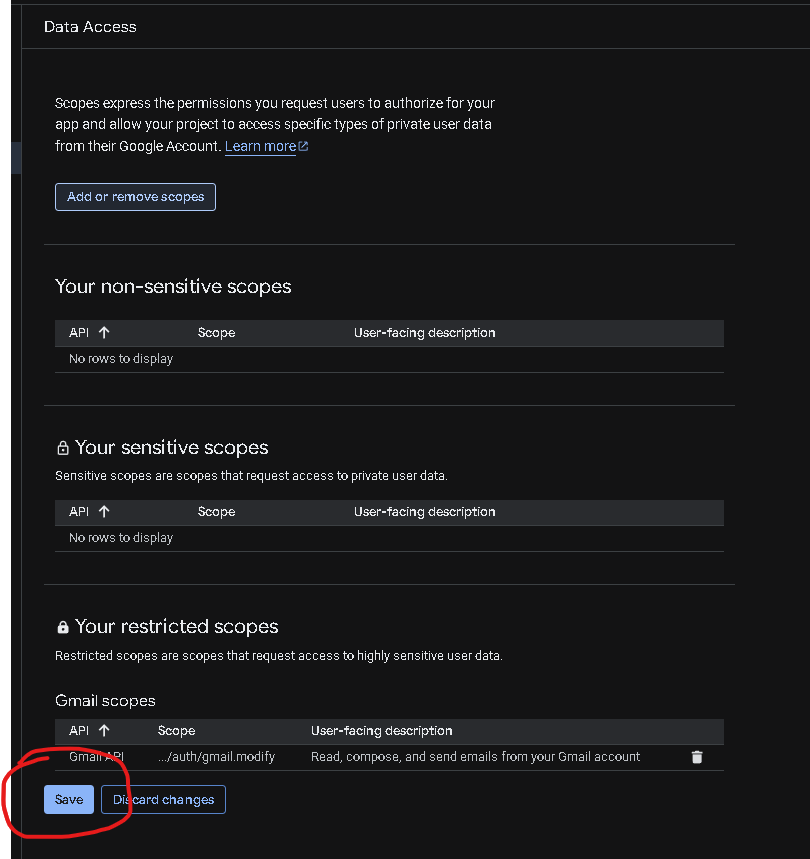

5. **Test users** (while the app is in **Testing** publishing status)
   - Add **your own Google account email** (and any other accounts that should be allowed to sign in).
   - Unverified external apps in Testing mode can only sign in for listed test users.
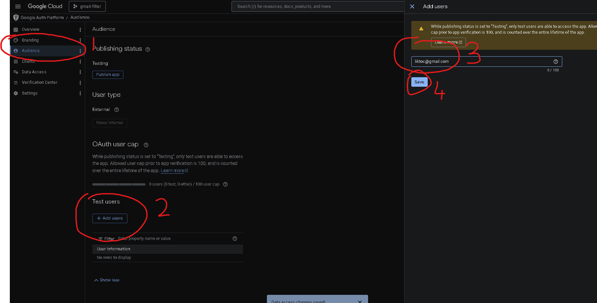
You might get this message but if you refresh and your email appears in the test users section you should be fine.
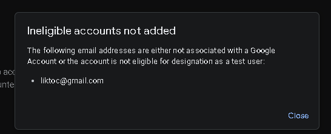

If you later add or change scopes, users should **sign out** in the app and **sign in again** so Google issues a new access token.


### 2.4 Create OAuth client credentials

1. Go to **APIs & Services** → **Credentials**.
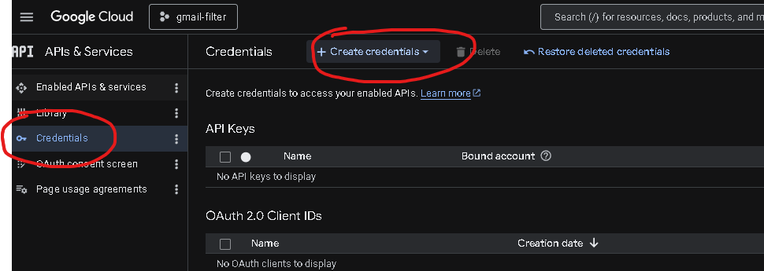

2. **Create credentials** → **OAuth client ID**.
3. If prompted, configure the **OAuth consent screen** first (previous section).
4. **Application type**: **Web application**.
5. **Name**: any label (e.g. `Gmail Filter local`).
6. **Authorized redirect URIs** — **Add URI** and enter **exactly** (scheme, host, port, path):

   ```text
   http://localhost:8000/api/auth/callback
   ```

   This must match `REDIRECT_URI` in your `.env` character-for-character (`http` not `https` unless you terminate TLS elsewhere and change the app accordingly).

7. Click **Create**.
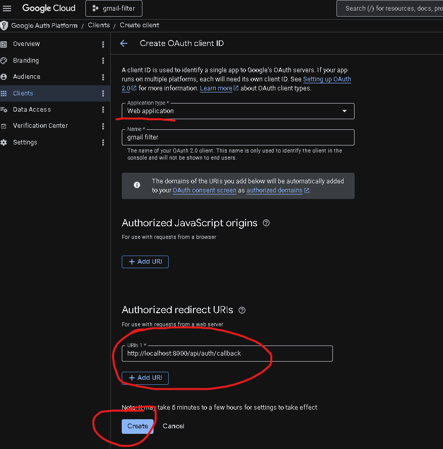

8. Copy the **Client ID** and **Client secret** (you will paste them into `.env`).
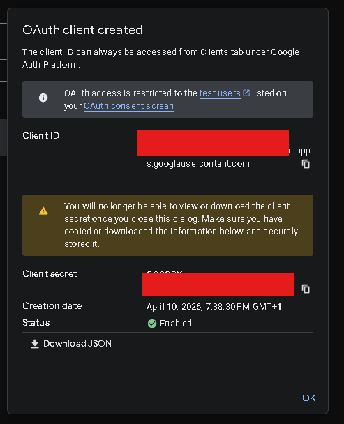


### 2.5 Configure `.env`

Edit `.env` in the project root:

```env
GOOGLE_CLIENT_ID=your-client-id.apps.googleusercontent.com
GOOGLE_CLIENT_SECRET=your-client-secret
REDIRECT_URI=http://localhost:8000/api/auth/callback
```

Restart the stack if it was already running (`docker compose down` then `docker compose up --build`) so the container picks up the new variables.

---

## 3. Using the app


### 3.1 Recommended workflow

1. **Sign in** — Click **Sign in with Google** and approve access (you must be a **test user** while the OAuth app is in Testing mode).


2. **Full sync first** — Use **Load all mail (full sync)** to index metadata for mail matching Gmail query `in:anywhere` into the local cache.  
   - This can take a **long time** for large inboxes (many API calls).  
   - The **Job** panel shows progress; you can **Force cancel** and run sync again later.  
   - Trashed messages are not kept in the cache (they disappear from aggregates after a resync).
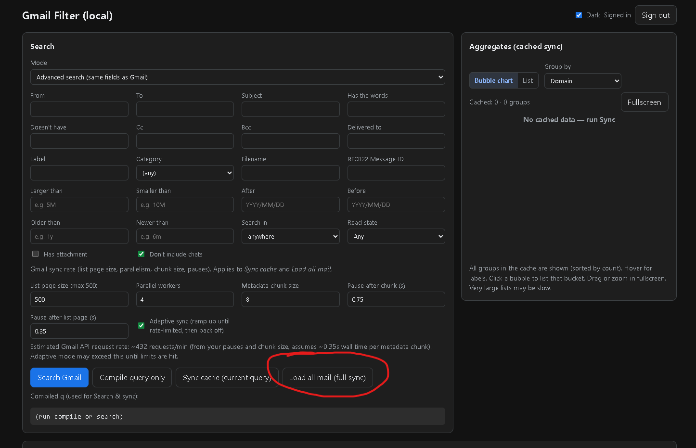
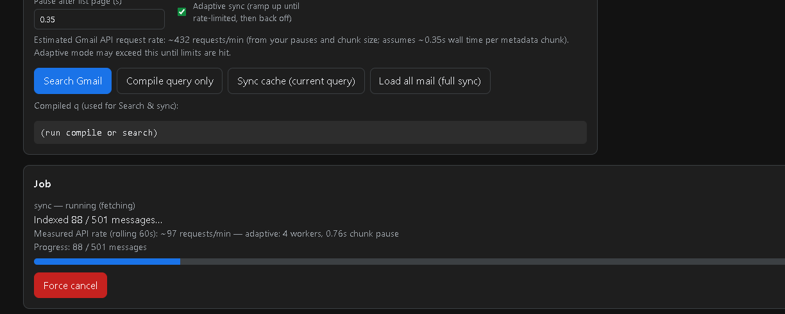


3. **Review groups** — Open **Aggregates (cached sync)**: choose **Group by** (domain, sender, age, newsletter heuristic). The UI lists **all** groups in the cache (sorted by message count). Use the **chart** or **list** view; click a bubble or row to load messages for that bucket from the **cache** (not live Gmail).
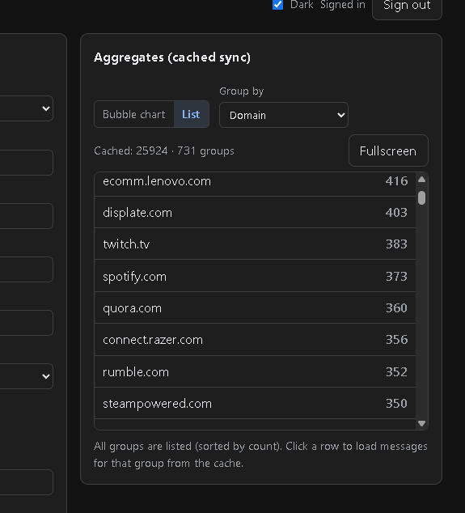


4. **Decide what to do** — In the results table, select messages and use **Archive**, **Trash** (queued with progress), **Mark read/unread**, etc. Use **Search Gmail** when you need **live** Gmail results with an arbitrary `q`; aggregates and cache lists use **synced** data.
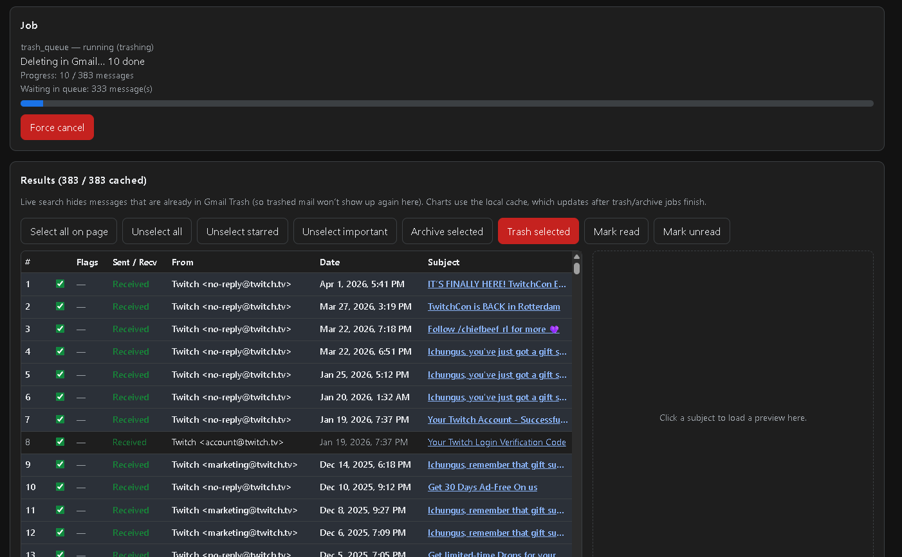


This “sync once (or periodically), then triage by group” flow is the **standard** way to use the tool. Live search is optional for spot checks or queries you have not synced.

### 3.2 Other features (short)

- **Sync cache (current query)** — Indexes only what matches your compiled query (useful for partial syncs).
- **Advanced search / Raw query** — Same ideas as Gmail’s UI; **Compile query** shows the `q` string.


- **Trash selected** — Uses a **trash queue** so you can enqueue more deletes while a job runs; progress shows what was deleted.


- **Search Gmail** — Live API list; by default excludes messages with the **TRASH** label so trashed mail does not reappear.

---

## 4. Rate limiting & sync tuning (optional)

**Defaults are intended to work for many users** without editing config. You do **not** need to tune throughput unless you hit **403/429** quota errors or want faster/slower sync.

### 4.1 In the web UI (sync jobs)

Under **Search**, the **Gmail sync rate** section applies to **Sync cache** and **Load all mail**:

- List page size, parallel workers, metadata chunk size, pauses between chunks / list pages.
- **Estimated** requests/min is shown for your settings.
- **Adaptive sync** (on by default) ramps speed until Gmail rate-limits, then backs off; you can turn it off for fixed pauses only.

These values are sent per sync request; they **override** server defaults from `.env` for that job only.

### 4.2 In `.env` (server defaults)

Optional variables (see `.env.example` comments). Omit them to use built-in defaults.

| Variable | Default (typical) | Purpose |
|----------|-------------------|---------|
| `GMAIL_LIST_PAGE_SIZE` | `500` | IDs per `messages.list` during sync (max 500). |
| `GMAIL_PARALLEL_WORKERS` | `4` | Max concurrent `messages.get` calls within a chunk. |
| `GMAIL_ENRICH_CHUNK_SIZE` | `8` | Messages per metadata chunk before a pause. |
| `GMAIL_SYNC_CHUNK_PAUSE_SECONDS` | `0.75` | Pause after each metadata chunk (sync + search enrich). |
| `GMAIL_LIST_PAGE_PAUSE_SECONDS` | `0.35` | Pause after each `messages.list` page during sync. |
| `GMAIL_ADAPTIVE_SYNC` | `true` | Adaptive ramp/backoff during sync (sync job). |
| `GMAIL_HTTP_TIMEOUT_SECONDS` | `300` | HTTP timeout per Google API request. |
| `GMAIL_RETRY_*` | (see `.env.example`) | Backoff when Google returns quota / rate limit errors. |

If you still see **quota exceeded** (`403` / `429`), try lowering **`GMAIL_PARALLEL_WORKERS`**, increasing **`GMAIL_SYNC_CHUNK_PAUSE_SECONDS`** or **`GMAIL_LIST_PAGE_PAUSE_SECONDS`**, or reducing **`GMAIL_LIST_PAGE_SIZE`**.

**Search results page size** in the UI is **`GMAIL_LIST_LIMIT`** in `frontend/src/App.tsx` (default 100; max 500).

---

## 5. Local development (optional)

**Backend** (from `backend/`, Python 3.12+):

```bash
pip install -r requirements.txt
set DATA_DIR=.\data
set GOOGLE_CLIENT_ID=...
set GOOGLE_CLIENT_SECRET=...
set REDIRECT_URI=http://localhost:8000/api/auth/callback
uvicorn app.main:app --reload --host 127.0.0.1 --port 8000
```

**Frontend** (from `frontend/`):

```bash
npm install
npm run build
```

Copy `frontend/dist/` into `backend/static/` (keep `assets/`), then restart uvicorn, **or** run `npm run dev` — Vite proxies `/api` to `http://127.0.0.1:8000` (`frontend/vite.config.ts`).

---

## 6. Removing the app and revoking access

### 6.1 Revoke Google access

1. [Google Account](https://myaccount.google.com/) → **Security**.
2. **Third-party apps** / **Connections to third-party apps** → find this app → **Remove access**.

### 6.2 Remove Docker data

In the project folder:

```bash
docker compose down --volumes
```

This deletes the named volume (including `tokens.json` and `gmail_cache.sqlite3`).

Optional: `docker image prune -f` to remove unused images.

### 6.3 Delete project files and optional Cloud cleanup

- Delete the project directory (including `.env`).
- If you no longer need the OAuth client: [Cloud Console](https://console.cloud.google.com/) → **APIs & Services** → **Credentials** — delete the OAuth 2.0 Client ID or the whole project.

---

## API scopes

- `https://www.googleapis.com/auth/gmail.modify` — read/search and modify labels (archive, trash, read/unread).

---

## Security notes

- Do not commit `.env` or `tokens.json`.
- **Force cancel** stops after the current batch; completed API actions are **not** rolled back.

---

## Troubleshooting

| Issue | What to check |
|--------|----------------|
| `redirect_uri_mismatch` | Redirect URI in Cloud Console must match `REDIRECT_URI` exactly (`http`, host, port, path). |
| “Access blocked” / consent | Add your account as a **Test user** while the app is in **Testing** mode. |
| `invalid_client` | Typos in Client ID/secret; recreate credentials if needed. |
| API quota / rate limits | Lower workers or raise pauses (see **Section 4**); use **Force cancel** on long syncs. |
| Charts / lists empty | Run **Load all mail** or **Sync cache** so SQLite has data. |
| Full-text body search | **Search Gmail** uses live Gmail `q`. The cache stores metadata/snippet for aggregates. |

---

## License

MIT (project template; verify compliance with Google API Terms of Service for your use case).
